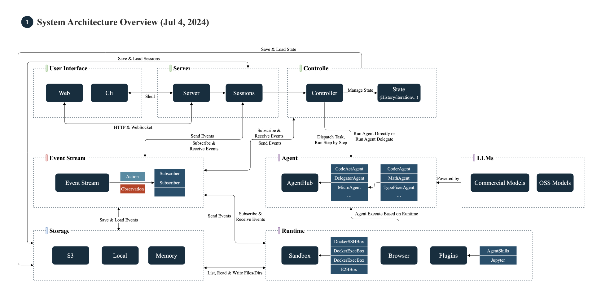
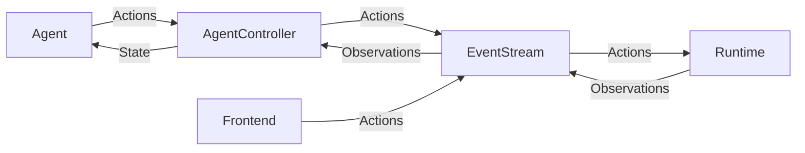
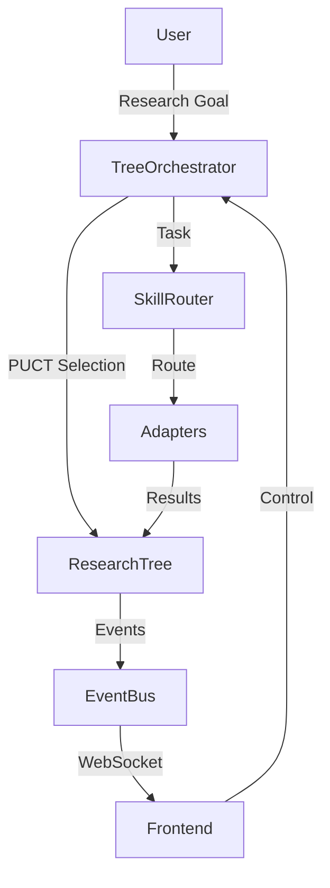

# OpenHands-UAgent Architecture

This directory contains the core components of OpenHands-UAgent, an advanced AI research and development system that combines autonomous software engineering with intelligent research capabilities.

## System Overview

**OpenHands-UAgent** extends the original OpenHands architecture with:
- **Research Tree System**: PUCT-based adaptive exploration for complex research tasks
- **Multi-Agent Research**: Specialized adapters for web research, code analysis, and experimentation
- **Real-Time Visualization**: Interactive tree visualization of research progress
- **Hybrid Execution**: Seamless switching between direct task execution and research mode

This diagram provides an overview of the roles of each component and how they communicate and collaborate.


## Classes

The key classes in OpenHands are:

* LLM: brokers all interactions with large language models. Works with any underlying completion model, thanks to LiteLLM.
* Agent: responsible for looking at the current State, and producing an Action that moves one step closer toward the end-goal.
* AgentController: initializes the Agent, manages State, and drive the main loop that pushes the Agent forward, step by step
* State: represents the current state of the Agent's task. Includes things like the current step, a history of recent events, the Agent's long-term plan, etc
* EventStream: a central hub for Events, where any component can publish Events, or listen for Events published by other components
  * Event: an Action or Observeration
      * Action: represents a request to e.g. edit a file, run a command, or send a message
      * Observation: represents information collected from the environment, e.g. file contents or command output
* Runtime: responsible for performing Actions, and sending back Observations
    * Sandbox: the part of the runtime responsible for running commands, e.g. inside of Docker
* Server: brokers OpenHands sessions over HTTP, e.g. to drive the frontend
    * Session: holds a single EventStream, a single AgentController, and a single Runtime. Generally represents a single task (but potentially including several user prompts)
    * ConversationManager: keeps a list of active sessions, and ensures requests are routed to the correct Session

## Control Flow

Here's the basic loop (in pseudocode) that drives agents.

```python
while True:
  prompt = agent.generate_prompt(state)
  response = llm.completion(prompt)
  action = agent.parse_response(response)
  observation = runtime.run(action)
  state = state.update(action, observation)
```

In reality, most of this is achieved through message passing, via the EventStream.
The EventStream serves as the backbone for all communication in OpenHands.



## Runtime

Please refer to the [documentation](https://docs.all-hands.dev/usage/architecture/runtime) to learn more about `Runtime`.

## Research Tree System (UAgent Extension)

OpenHands-UAgent adds a sophisticated research tree system built on top of the core architecture:

### Additional Components

* **TreeSearchOrchestrator**: Manages PUCT-based tree search for adaptive research exploration
  * Generates research ideas from user goals
  * Selects promising branches using PUCT scoring: `Q + c * P * sqrt(N) / (1 + n)`
  * Coordinates parallel execution of research tasks

* **Research Adapters**: Specialized agents for different research modalities
  * **DeepResearchAdapter**: Web search and content extraction (Bing + browser automation)
  * **RepoMasterAdapter**: GitHub repository search and analysis
  * **CodeActAdapter**: Code execution and hypothesis validation

* **EventBus**: Enhanced event streaming with coalescing and backpressure handling
  * Bridges research events to WebSocket for real-time frontend updates
  * Supports 8 event types: Plan, Step, ToolCall, Observation, Summary, Critique, Complete, Error

* **WebSocketPublisher**: Streams research tree updates to frontend
  * ROMA-compatible message format with version tracking
  * Incremental delta updates for efficient network usage

### Research Flow

```python
while not research_complete:
  # Select most promising node using PUCT
  node = orchestrator.select_best_node(tree)

  # Route to appropriate adapter
  adapter = router.select_adapter(node.task)

  # Execute research task
  result = await adapter.run(node)

  # Update tree with results
  tree.update_node(node, result)

  # Stream updates to frontend
  event_bus.publish(NodeUpdatedEvent(node))
```

### Research Tree Visualization



### When to Use Research Mode

The system automatically determines when to use research mode based on:
- Task complexity (requires exploration vs. direct execution)
- User intent (explicit "research" keywords or exploratory questions)
- Task type (synthesis, comparison, discovery vs. implementation)

For more details, see `/extensions/uagent_research/` documentation.
