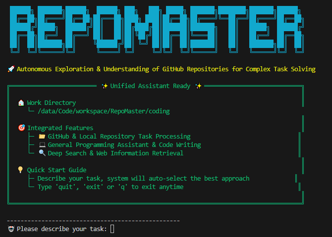

<div align="center">

  

<h1 align="center" style="color: #2196F3; font-size: 24px; font-weight: 600; margin: 20px 0; line-height: 1.4;">
  🌟 RepoMaster: <span style="color: #555; font-weight: 400; font-size: 18px;"><em>让千万GitHub仓库为您所用</em></span>
</h1>

<p align="center" style="font-size: 16px; color: #666; margin: 10px 0; font-weight: 500;">
  🚀 <em>将GitHub仓库转化为您的个人AI工具箱</em>
</p>

  <p style="margin: 20px 0;">
    <a href="https://arxiv.org/pdf/2505.21577"></a>
    <a href="https://github.com/openai/mle-bench"></a>
    <a href="https://github.com/QuantaAlpha/GitTaskBench"></a>
    <a href="#"></a>
    <a href="#"></a>
  </p>

  <!-- <p style="margin: 15px 0;">
    
    
    
    
  </p> -->

  <p style="font-size: 16px; color: #666; margin: 15px 0; font-weight: 500;">
    🌐 <a href="README.md" style="text-decoration: none; color: #0066cc;">English</a> | <a href="README_CN.md" style="text-decoration: none; color: #0066cc;">中文</a>
  </p>

</div>

## 📰 News

- **2025.08.28** 🎉 We open-sourced [**RepoMaster**](https://github.com/QuantaAlpha/RepoMaster) — an AI agent that leverages GitHub repos to solve complex real-world tasks.
- **2025.08.26** 🎉 We open-sourced [**GitTaskBench**](https://github.com/QuantaAlpha/GitTaskBench) — a repo-level benchmark & tooling suite for real-world tasks.
- **2025.08.10** 🎉 We open-sourced [**SE-Agent**](https://github.com/JARVIS-Xs/SE-Agent) — a self-evolution trajectory framework for multi-step reasoning.

> 🔗 **Ecosystem**: [RepoMaster](https://github.com/QuantaAlpha/RepoMaster) · [GitTaskBench](https://github.com/QuantaAlpha/GitTaskBench) · [SE-Agent](https://github.com/JARVIS-Xs/SE-Agent) · [Team Homepage](https://quantaalpha.github.io)
---

<div align="center" style="margin: 30px 0;">
  <a href="#-快速开始" style="text-decoration: none; margin: 0 8px;">
    
  </a>
  <a href="#-快速演示" style="text-decoration: none; margin: 0 8px;">
    
  </a>
  <a href="USAGE.md" style="text-decoration: none; margin: 0 8px;">
    
  </a>
</div>

---


## 🚀 概述

<div align="center">
  <h3>🎯 发现 · 理解 · 执行 - 让开源为您所用</h3>
  
  <p style="font-size: 16px; color: #666; max-width: 800px; margin: 0 auto; line-height: 1.6;">
    RepoMaster 通过<strong>自动找到合适的GitHub工具</strong>并让它们无缝协作，彻底改变了您解决编程任务的方式。只需描述您的需求，看着开源仓库成为您的智能助手。
  </p>
  
  <p style="font-size: 16px; color: #2196F3; max-width: 800px; margin: 15px auto; line-height: 1.6; font-weight: 600;">
    💬 描述任务 → 🧠 AI分析 → 🔍 自动发现 → ⚡ 智能执行 → ✅ 完美结果
  </p>
</div>

<br/>


---

## 快速开始

### 安装

```bash
git clone https://github.com/QuantaAlpha/RepoMaster.git
cd RepoMaster
pip install -r requirements.txt
```

### 配置

复制示例配置文件并使用您的API密钥进行自定义：

```bash
cp configs/env.example configs/.env
# 使用您喜欢的编辑器编辑配置文件
nano configs/.env  # 或使用 vim, code 等
```

**必需的API密钥：**

```bash
# 主要AI提供商配置（必需）
OPENAI_API_KEY=your_openai_api_key_here
OPENAI_MODEL=gpt-5

# 外部服务API（深度搜索功能必需）
SERPER_API_KEY=your_serper_key          # Google搜索集成
JINA_API_KEY=your_jina_key              # 网页内容提取

# 可选：其他AI提供商
# ANTHROPIC_API_KEY=your_claude_key     # Anthropic Claude支持
# DEEPSEEK_API_KEY=your_deepseek_key    # DeepSeek集成
# GEMINI_API_KEY=your_gemini_key        # Google Gemini支持
```

💡 **提示**: `configs/env.example` 文件包含所有可用的配置选项和详细注释。

### 启动

**Web界面（推荐初学者使用）：**
```bash
python launcher.py --mode frontend
# 访问Web仪表板：http://localhost:8501
```

**命令行界面（推荐高级用户使用）：**
```bash
python launcher.py --mode backend --backend-mode unified
# 通过终端提供智能多代理编排
```

**专用代理访问：**
```bash
python launcher.py --mode backend --backend-mode deepsearch      # 深度搜索代理
python launcher.py --mode backend --backend-mode general_assistant  # 编程助手
python launcher.py --mode backend --backend-mode repository_agent   # 仓库代理
```

> 📘 **需要帮助？** 查看我们的综合[用户指南](USAGE.md)获取高级配置、故障排除和详细使用示例。


---

## 🎯 快速演示

<div align="center">
  <h3>💬 自然语言 → 🤖 自主执行 → ✨ 真实结果</h3>
  <p style="font-size: 16px; color: #666; margin: 20px 0; max-width: 700px;">
    只需用自然语言描述您的任务。RepoMaster的AI会自动分析您的请求，智能路由到最优解决方案路径，并编排完美的GitHub工具来实现您的想法。
  </p>
</div>

| 任务描述 | RepoMaster操作 | 结果 |
|------------------|-------------------|---------|
| *"帮我从这个网页上抓取产品价格"* | 🔍 找到抓取工具 → 🔧 自动配置 → ✅ 提取数据 | 结构化CSV输出 |
| *"将照片转换成梵高风格"* | 🔍 找到风格迁移仓库 → 🎨 处理图像 → ✅ 生成艺术 | 艺术杰作 |

<div align="center" style="background: linear-gradient(135deg, #FF6B6B 0%, #4ECDC4 100%); border-radius: 15px; padding: 20px; margin: 20px auto; max-width: 700px;">
  <p style="color: white; margin: 5px 0; font-size: 16px;">从<strong>"从零开始编写代码"</strong> → 到<strong>"让开源为我所用"</strong></p>
</div>

### 🎨 神经风格迁移案例研究

<div align="center">

<table style="border: none; background: linear-gradient(135deg, #667eea 0%, #764ba2 100%); border-radius: 15px; padding: 20px; margin: 20px 0;">
<tr>
<td align="center" width="33%" style="padding: 10px;">
  <h4 style="color: white; margin-bottom: 10px;">📷 原始图像</h4>
  <div style="background: white; border-radius: 10px; padding: 5px;">
    
  </div>
</td>
<td align="center" width="33%" style="padding: 10px;">
  <h4 style="color: white; margin-bottom: 10px;">🎨 风格参考</h4>
  <div style="background: white; border-radius: 10px; padding: 5px;">
    
  </div>
</td>
<td align="center" width="33%" style="padding: 10px;">
  <h4 style="color: white; margin-bottom: 10px;">✨ 最终结果</h4>
  <div style="background: white; border-radius: 10px; padding: 5px;">
    
  </div>
</td>
</tr>
</table>

</div>

### 🎬 完整执行演示 | [📺 YouTube演示](https://www.youtube.com/watch?v=Kva2wVhBkDU)

<div align="center">

https://github.com/user-attachments/assets/a21b2f2e-a31c-4afd-953d-d143beef781a

*RepoMaster自主执行神经风格迁移任务的完整过程*

</div>

**更多高级用法、配置选项和故障排除，请参阅我们的[用户指南](USAGE.md).**

---

## 🤝 贡献

<div align="center">
  <h3>🌟 加入我们的使命，革命化代码智能</h3>
  <p style="color: #666; margin: 15px 0;">
    我们相信社区驱动创新的力量。您的贡献帮助让RepoMaster变得更智能、更快速、功能更强大。
  </p>
</div>

### 🚀 贡献方式

- **🐛 问题报告**: 通过[报告问题](https://github.com/QuantaAlpha/RepoMaster/issues)帮助我们识别和修复问题。
- **💡 功能请求**: 有好想法？[建议新功能](https://github.com/QuantaAlpha/RepoMaster/discussions)。
- **📖 文档**: 通过贡献我们的[文档](docs/)来改进清晰度和示例。
- **💻 代码贡献**: 准备开始？查看我们的[开发环境设置](#development-setup)开始贡献。

### 🛠️ 开发环境设置

<details open>
<summary><strong>快速开发环境设置</strong></summary>

```bash
# Fork并克隆仓库
git clone https://github.com/your-username/RepoMaster.git
cd RepoMaster

# 安装开发依赖
pip install -e ".[dev]"

# 设置代码质量预提交钩子
pre-commit install

# 运行测试确保一切正常
pytest tests/

# 开始开发！🚀
```

</details>

> 📋 **初次接触开源？** 查看我们的[贡献指南](CONTRIBUTING.md)获取详细说明和最佳实践。

---

## 📄 许可证

本项目采用 MIT 许可证 - 详见 [LICENSE](LICENSE) 文件。

---

## 📞 支持

- 📧 **邮箱**: quantaalpha.ai@gmail.com
- 🐛 **问题**: [GitHub Issues](https://github.com/QuantaAlpha/RepoMaster/issues)
- 💬 **讨论**: [GitHub Discussions](https://github.com/QuantaAlpha/RepoMaster/discussions)
- 📖 **文档**: [完整文档](docs/)

---

## 🙏 致谢

特别感谢：
- [AutoGen](https://github.com/microsoft/autogen) - 多代理框架
- [OpenHands](https://github.com/All-Hands-AI/OpenHands) - 软件工程代理
- [SWE-Agent](https://github.com/princeton-nlp/SWE-agent) - GitHub问题解决代理
- [MLE-Bench](https://github.com/openai/mle-bench) - 机器学习工程基准

---

## 🌐 关于 QuantaAlpha

- QuantaAlpha 成立于 **2025 年 4 月**，由来自 **清华、北大、中科院、CMU、港科大** 等高校的教授、博士后、博士与硕士组成。  

🌟 我们的使命是探索智能的 **"量子"**，引领智能体研究的 **"阿尔法"** 前沿 —— 从 **CodeAgent** 到 **自进化智能**，再到 **金融与跨领域专用智能体**，致力于重塑人工智能的边界。 

✨ 在 **2025 年**，我们将在以下方向持续产出高质量研究成果：  
- **CodeAgent**：真实世界任务的端到端自主执行  
- **DeepResearch**：深度推理与信息检索增强  
- **Agentic Reasoning / Agentic RL**：智能体推理与强化学习  
- **自进化与协同学习**：多智能体的自我进化与协作  

📢 欢迎对我们方向感兴趣的同学加入！  

🔗 团队主页：[QuantaAlpha](https://quantaalpha.github.io/)

---

## 📖 Citation

如果你觉得RepoMaster对你的研究有帮助，请引用我们的工作：

```bibtex
@article{wang2025repomaster,
  title={RepoMaster: Autonomous Exploration and Understanding of GitHub Repositories for Complex Task Solving},
  author={Huacan Wang and Ziyi Ni and Shuo Zhang and Lu, Shuo and Sen Hu and  Ziyang He and Chen Hu and Jiaye Lin and Yifu Guo and Ronghao Chen and Xin Li and Daxin Jiang and Yuntao Du and Pin Lyu},
  journal={arXiv preprint arXiv:2505.21577},
  year={2025},
  doi={10.48550/arXiv.2505.21577},
  url={https://arxiv.org/abs/2505.21577}
}
```

---

<div align="center">

**⭐ 如果 RepoMaster 对您有帮助，请给我们一个星标！**

Made with ❤️ by the QuantaAlpha Team

</div> 
